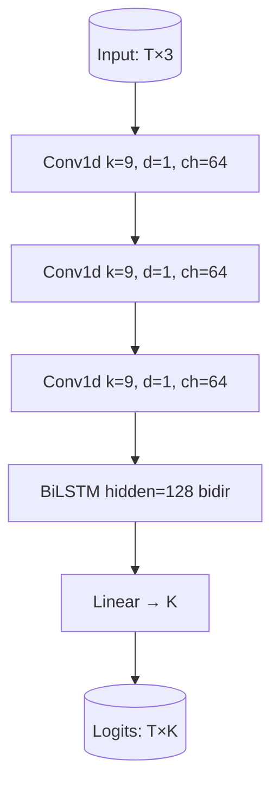
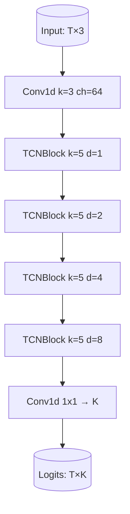

## Parkinson’s Freezing of Gait (FoG) — Algorithm Guide

This document explains the ML/DL pipeline, models, metrics, configurations, and artifacts used in this repository. It also provides simple diagrams, key file locations, chosen parameters/weights, and a detailed improvement plan to address the current low accuracy.

### Quick facts
- Task: detect FoG-related events from wearable IMU time series, framed as multi‑label detection for classes: `StartHesitation`, `Turn`, `Walking`.
- Input: IMU windows of length 5 s at 100 Hz (configurable), 3 channels.
- Output: per-class probabilities per window, then post-processed to time intervals.
- Models: CNN‑BiLSTM and TCN; an ensemble blends both.
- Primary metric: macro Average Precision (AP) over window/interval detections.

### End‑to‑end flow
```mermaid
flowchart LR
  A[Raw CSVs under train/defog & train/tdcsfog] --> B[Windowing 5s / 50% overlap]
  B --> C[Transforms: Standardize, Jitter, Scale, Rotate3D]
  C --> D1[CNN-BiLSTM]
  C --> D2[TCN]
  D1 --> E1[Per-time-step logits -> window probs]
  D2 --> E2[Per-time-step logits -> window probs]
  E1 --> F[OOF/Val Probs]
  E2 --> F
  F --> G[Threshold tuning & Isotonic calibration]
  G --> H[Per-class thresholds + optional calibrators]
  H --> I[Ensemble (weights.json)]
  I --> J[Postprocess probs→intervals (hysteresis, min_duration, merge)]
  J --> K[Scoring: IoU≥0.5, PR/AP → macro AP]
```

---

## Data pipeline

- Windowing and dataset: `src/data/dataset.py`
  - `WindowDataset(paths, window_s=5, overlap=0.5, sample_rate_hz=100, label_cols=...)`
  - Generates per-window tensors `(T, C)` and optional window labels `(K,)`.
- Window parameters and paths: `configs/data.yaml`
  - `sample_rate_hz: 100`, `window_s: 5`, `overlap: 0.5`
  - Data locations under `train/defog`, `train/tdcsfog`, unlabeled under `unlabeled/`.
- Transforms: `src/data/transforms.py`
  - `StandardizePerWindow`, `Jitter(sigma=0.01, p=0.5)`, `Scale(0.95,1.05,p=0.5)`, `Rotate3D(max_deg=5, p=0.5)`.

Example usage
```python
from torch.utils.data import DataLoader
from src.data.dataset import WindowDataset
from src.data.transforms import Compose, StandardizePerWindow

labels = ["StartHesitation", "Turn", "Walking"]
ds = WindowDataset(paths, window_s=5, overlap=0.5, sample_rate_hz=100, label_cols=labels,
                   transform=Compose([StandardizePerWindow()]))
dl = DataLoader(ds, batch_size=32, shuffle=True)
```

---

## Models

### CNN‑BiLSTM
- File: `src/models/cnn_bilstm.py`
- Architecture: stacked 1D conv blocks (kernel≈9, BN, ReLU, Dropout) → BiLSTM → linear head.
- Default config: `configs/model_cnn_bilstm.yaml`
  - `conv_blocks: 3`, `dropout: 0.3`, `lstm_hidden: 128`, `num_classes: 3`

```python
class CNNBiLSTM(nn.Module):
    def __init__(self, num_classes=3, conv_blocks=3, hidden=128, dropout=0.3):
        self.cnn = nn.Sequential(*[ConvBlock(...) for _ in range(conv_blocks)])
        self.rnn = nn.LSTM(input_size=64, hidden_size=hidden, batch_first=True, bidirectional=True)
        self.head = nn.Linear(hidden * 2, num_classes)
    def forward(self, x):        # x: (B, T, C)
        x = x.transpose(1, 2)    # (B, C, T)
        x = self.cnn(x)          # (B, ch, T)
        x = x.transpose(1, 2)    # (B, T, ch)
        out, _ = self.rnn(x)     # (B, T, 2*hidden)
        return self.head(out)    # (B, T, K)
```

When/why to choose
- **Pros**: CNN captures local patterns; BiLSTM captures longer temporal context; robust for sequential dynamics.
- **Cons**: Heavier than pure CNN; may blur precise boundaries without explicit segmentation loss.

### Temporal Convolutional Network (TCN)
- File: `src/models/tcn.py`
- Architecture: input 1D conv → stack of dilated TCN blocks → 1×1 conv head.
- Default config: `configs/model_tcn.yaml`
  - `layers: 4`, `ch: 64`, `dropout: 0.2`, `num_classes: 3`

```python
class TCN(nn.Module):
    def __init__(self, num_classes=3, layers=4, ch=64, dropout=0.2):
        self.inp = nn.Conv1d(3, ch, kernel_size=3, padding=1)
        self.tcn = nn.Sequential(*[TCNBlock(ch, k=5, d=2**i, p=dropout) for i in range(layers)])
        self.head = nn.Conv1d(ch, num_classes, kernel_size=1)
    def forward(self, x):        # x: (B, T, C)
        x = x.transpose(1, 2)
        x = self.inp(x)
        x = self.tcn(x)
        logits = self.head(x)    # (B, K, T)
        return logits.transpose(1, 2)
```

When/why to choose
- **Pros**: Efficient, large receptive fields via dilation; stable training; low latency for streaming.
- **Cons**: May underperform on very long dependencies vs RNN/attention; boundary precision depends on dilation/stride choices.

Model registry
- File: `src/models/registry.py` provides `build_model("cnn_bilstm"|"tcn", ...)` and maps YAML to constructor args.

---

## Training

- Typical flow (fold‑wise): `src/train/run_fold_train.py`, `src/train/run_fold_train_tcn.py`
  - Optimizer: AdamW, `lr=1e-3`, `weight_decay=1e-4`
  - Loss: Focal BCE with logits (`gamma=1.5`), per‑window pooling by mean over time.
  - LR schedule: cosine with warmup.
  - Early stopping: `patience≈7` (fold scripts) or `training_baseline.yaml: early_stop_patience: 25`.
  - Positive‑aware sampling placeholder at `positive_ratio: 0.4` (see config and fold script scaffold).
- Baseline training config: `configs/training_baseline.yaml`
  - `epochs: 100`, `mixed_precision: true`, `optimizer: adamw`, `scheduler: cosine_warmup`.

Core training step (simplified)
```python
logits = model(x)                 # (B, T, K)
window_logits = logits.mean(1)    # (B, K)  time-average
loss = FocalBCEWithLogitsLoss(gamma=1.5)(window_logits, y)
loss.backward(); optimizer.step()
```

---

## Inference and post‑processing

- Single model inference: `src/serve/infer.py`
  - Writes per‑file window probabilities to `output_dir/{file}_probs.csv`.
- Ensemble inference and intervals: `src/serve/ensemble_infer.py`
  - Runs both models (or fold‑avg), blends using `artifacts/ensemble/weights.json`, applies thresholds/calibrators, converts to intervals, writes results.
- Post‑processing: `src/eval/postprocess.py` (hysteresis, min duration, merge gaps)
  - Defaults in `configs/postprocess.yaml`, domain overrides for `defog` and `tdcsfog`.

Intervals conversion (key logic)
```python
def probs_to_intervals(probs, classes, fps, thresholds, hysteresis=(0.6, 0.4),
                       min_duration_s=0.3, merge_gap_s=0.5):
    # Start when p >= start_thr; continue while p >= continue_thr
    # Enforce min_duration; merge intervals if gap <= merge_gap_s
    ...
```

---

## Evaluation and metrics

- Primary metric: macro AP (Average Precision) over classes.
  - Window AP: `src/eval/window_ap.py`
  - Interval scoring: `src/eval/scorer.py` with IoU≥0.5 match and PR/AP computation.
- Cross‑validation computation: `src/eval/compute_cv_metrics.py`
  - Loads per‑fold checkpoints, thresholds, calibrators; computes fold scores; saves `artifacts/metrics/metrics.json` and website copy.

Current results (from `artifacts/metrics/metrics.json`)
```json
{"cv": {"macro_ap": 0.1297, "cnn": 0.1247, "tcn": 0.1311, "ensemble_w_cnn": 0.725}}
```
- Interpretation: low macro AP indicates frequent false positives/negatives under current settings; the ensemble slightly improves over individual models.

Interval scoring sketch
```python
ap_by_class = score_intervals(preds_by_class, gts_by_class, classes=["StartHesitation","Turn","Walking"], iou_thr=0.5)
macro_ap = mean_ap(ap_by_class)
```

---

## Ensembling

- OOF concatenation and weight fitting: `src/ensemble/concat_oof.py`, `src/ensemble/fit_weights.py`
  - Fits convex weights w∈[0,1] to maximize window AP on validation/OOF.
- Learned weights: `artifacts/ensemble/weights.json`
```json
{"cnn_bilstm": 0.725, "tcn": 0.275}
```
- Ensemble inference path combines probabilities per window and then applies thresholds/calibrators and postprocessing.

---

## Configurations and chosen parameters

- Data: `configs/data.yaml`
  - `sample_rate_hz: 100`, `window_s: 5`, `overlap: 0.5`
- CNN‑BiLSTM: `configs/model_cnn_bilstm.yaml`
  - `conv_blocks: 3`, `dropout: 0.3`, `lstm_hidden: 128`, `num_classes: 3`
- TCN: `configs/model_tcn.yaml`
  - `layers: 4`, `ch: 64`, `dropout: 0.2`, `num_classes: 3`
- Training baseline: `configs/training_baseline.yaml`
  - `epochs: 100`, `lr: 1e-3`, `weight_decay: 1e-4`, `focal_gamma: 1.5`, `positive_ratio: 0.4`
- Postprocess defaults: `configs/postprocess.yaml`
  - Per‑class thresholds (domain‑aware), hysteresis `(start: 0.6, continue: 0.4)`, `min_duration_s`, `merge_gap_s`

---

## Visual model sketches





---

## Key file locations

- Data pipeline: `src/data/dataset.py`, `src/data/transforms.py`, `configs/data.yaml`
- Models: `src/models/cnn_bilstm.py`, `src/models/tcn.py`, `src/models/registry.py`
- Training: `src/train/run_fold_train.py`, `src/train/run_fold_train_tcn.py`, `src/train/run_mixed_train.py`, `configs/training_baseline.yaml`
- Evaluation/metrics: `src/eval/window_ap.py`, `src/eval/scorer.py`, `src/eval/compute_cv_metrics.py`
- Threshold tuning & calibration: `src/eval/tune_thresholds.py`, `src/eval/calibrate_isotonic.py`, `configs/postprocess.yaml`
- Postprocess to intervals: `src/eval/postprocess.py`
- Ensembling: `src/ensemble/concat_oof.py`, `src/ensemble/fit_weights.py`, `artifacts/ensemble/weights.json`
- Serving: `src/serve/infer.py`, `src/serve/ensemble_infer.py`
- Checkpoints & metrics: `artifacts/checkpoints/`, `artifacts/metrics/metrics.json`

---

## Common commands

Train one fold (example)
```powershell
python -c "import sys, os; sys.path.append(os.getcwd()); from src.train.run_fold_train import main; main(fold=0, epochs=100)"
```

Tune thresholds, calibrate, compute CV metrics
```powershell
python -c "import sys, os; sys.path.append(os.getcwd()); from src.eval.tune_thresholds import main; main()"
python -c "import sys, os; sys.path.append(os.getcwd()); from src.eval.calibrate_isotonic import main; main()"
python -c "import sys, os; sys.path.append(os.getcwd()); from src.eval.compute_cv_metrics import main; main()"
```

Fit ensemble weights from OOF
```powershell
python -c "import sys, os; sys.path.append(os.getcwd()); from src.ensemble.fit_weights import main; main()"
```

Batch inference (single model)
```powershell
python -m src.serve.infer --input_dir test/defog --output_dir artifacts/infer/defog_cnn --checkpoint artifacts/checkpoints/cnn_bilstm_fold0_best.pt --model cnn_bilstm
```

Batch ensemble inference
```python
from src.serve.ensemble_infer import ensemble_and_postprocess
ensemble_and_postprocess(
    input_dir="test/defog",
    out_root="artifacts/infer/ens_defog",
    ckpt_cnn="artifacts/checkpoints/cnn_bilstm_fold*_best.pt",
    ckpt_tcn="artifacts/checkpoints/tcn_fold*_best.pt",
)
```

Export ONNX for web
```powershell
python scripts/export_onnx.py --ckpt artifacts/checkpoints/tcn_fold0_best.pt --model tcn --out website/netlify/assets/tcn.onnx --time_len 500
```

---

## Why these models and choices?

- Time‑series IMU patterns mix local motifs and longer context. CNNs excel at local patterns; LSTMs capture context; TCNs give large receptive fields with efficient convolutions. The ensemble balances their inductive biases.
- Window‑mean pooling stabilizes training against frame noise and simplifies multi‑label learning.
- Focal BCE helps when positives are sparse.
- Post‑processing with hysteresis and min duration reflects event semantics and reduces spurious toggling.

---

## Improvement plan to address low macro AP (~0.13)

Prioritize high‑impact, low‑risk items first. Each item notes what to change and where.

- Data and labels
  - Increase window overlap to 75% to densify supervision (edit `configs/data.yaml: overlap: 0.75`).
  - Check label alignment vs windowing stride; consider max‑over‑time pooling during training (already used at eval) to better capture short events.
  - Add stronger time‑series augmentations: time‑warp, channel dropout, per‑axis scaling (extend `src/data/transforms.py`).

- Losses and class imbalance
  - Tune `focal_gamma` and add per‑class weights proportional to inverse frequency in `FocalBCEWithLogitsLoss` (loss module and training scripts).
  - Label smoothing (e.g., 0.05) to mitigate annotation noise.

- Architecture and pooling
  - Multi‑scale CNN kernels and dilations (respect `configs/model_cnn_bilstm.yaml: kernels, dilations`) and reflect them in `cnn_bilstm.py`.
  - Add temporal attention pooling head (weighted time pooling) before the classifier.
  - Residual connections in Conv blocks; for TCN, increase `layers` and vary dilation schedule.

- Training dynamics
  - Longer training with cosine restarts; enable EMA of weights; try smaller base LR with warmup (`configs/training_baseline.yaml`).
  - Implement proper positive‑aware or hard‑negative sampler (complete `run_fold_train.py` sampler stub).
  - Mixed precision on GPU; gradient clipping (e.g., 1.0) for stability.

- Thresholds and calibration
  - Tune per‑fold thresholds on validation (`src/eval/tune_thresholds.py`), not just a fixed grid; optionally Bayesian optimization.
  - Isotonic calibration per class, per fold, and per domain (extend `src/eval/calibrate_isotonic.py`).

- Post‑processing
  - Domain‑aware `min_duration_s` and `merge_gap_s` already exist; refine by class using validation search.
  - Apply light smoothing (moving average `smooth=3..5`) pre‑hysteresis in `probs_to_intervals`.

- Ensembling
  - Cross‑validated fold‑averaging for both models (already supported by `ensemble_infer.py`).
  - Add more diverse backbones (e.g., 1D ResNet, GRU, attention Transformer) and refit weights (`src/ensemble/fit_weights.py`).
  - Try rank‑averaging to reduce calibration sensitivity.

- Diagnostics and error analysis
  - Per‑class PR curves and confusion over durations; analyze false positives around turns and gait starts.
  - Domain transfer: evaluate tdcs→defog and defog→tdcs; consider domain‑specific BN or adapters.

- Semi‑supervised / pretraining (optional)
  - Pretrain on `unlabeled/` with contrastive or masked forecasting objectives; fine‑tune supervised.

Suggested minimal next steps
1) Implement proper sampler and stronger augmentations.
2) Tune thresholds/calibration per fold/domain; smooth probs with MA(3).
3) Increase TCN receptive field (more layers) and add attention pooling to CNN‑BiLSTM.
4) Refit ensemble weights using updated OOF; re‑compute CV metrics.

---

## Artifacts and logs

- Checkpoints: `artifacts/checkpoints/` (e.g., `cnn_bilstm_fold0_best.pt`, `tcn_fold0_best.pt`).
- Ensemble weights: `artifacts/ensemble/weights.json`.
- Metrics: `artifacts/metrics/metrics.json` (also copied to `website/netlify/metrics.json`).
- Logs: `logs/*.log` (e.g., `train.log`, `ens_report.log`, `cv_metrics.log`).

---

## Appendix: small code references

Dataset item
```python
x: torch.Tensor (T, C=3); y: torch.Tensor (K) if labels available
return x, y
```

Window AP computation
```python
def window_ap(probs: np.ndarray, labels: np.ndarray) -> float:
    # per-class PR/AP then macro average
    ...
```

Interval IoU
```python
def iou_1d(a: Tuple[float,float], b: Tuple[float,float]) -> float:
    inter = max(0.0, min(e1, e2) - max(s1, s2))
    union = max(e1, e2) - min(s1, s2)
    return inter / union if union > 0 else 0.0
```

---

If you need a shorter, decision‑oriented summary for reviewers, see the top sections on flow, configs, and current metrics. For step‑by‑step commands, see “Common commands”.


