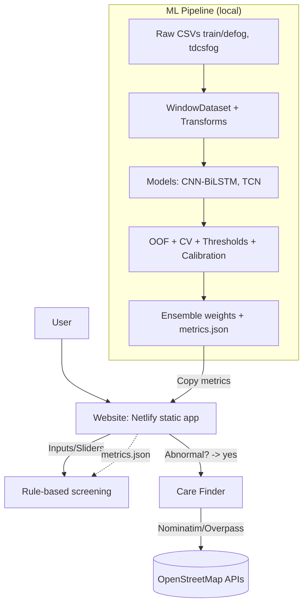
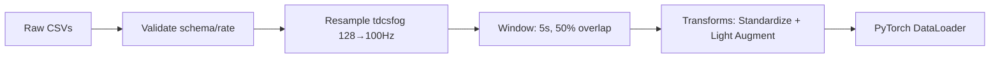
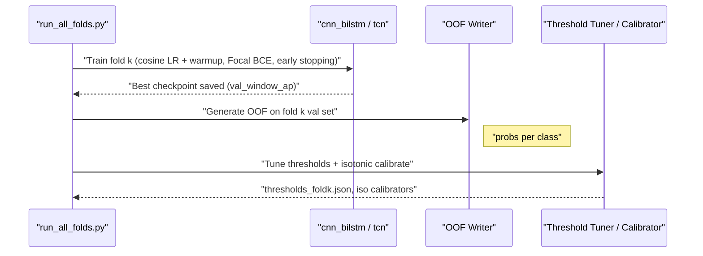

## Parkinson's Freezing of Gait (FOG) — Project Description

This document provides a high-level, technical yet simple overview of the project: dataset, pipeline, models, evaluation, web app, and operations. It includes diagrams and small code snippets to help new contributors ramp quickly.

### Goals
- Detect/flag gait abnormalities and FOG-related events from wearable accelerometer data
- Deliver a simple, modular, DRY pipeline with cross-validation, post-processing, calibration, and ensembling
- Provide a usable web “screening” interface and a practical Care Finder to help users locate clinicians

---

## System Architecture



---

## Dataset and Inputs

- Sources:
  - `train/defog/*` (home environment, ~100 Hz)
  - `train/tdcsfog/*` (clinical/lab, 128 Hz → resampled to 100 Hz)
  - Labels: `StartHesitation`, `Turn`, `Walking` in both sources
- Metadata: `subjects.csv`, `defog_metadata.csv`, `tdcsfog_metadata.csv`
- Unlabeled optional: `unlabeled/*.parquet` (for future SSL)

---

## Repository Structure (key paths)

```
configs/                  # YAML configs
src/
  common/                 # env, logging
  data/                   # validation, windowing, dataset, transforms
  models/                 # cnn_bilstm, tcn, registry
  losses/                 # focal bce and optional losses
  train/                  # per-fold training, OOF, orchestrator
  eval/                   # thresholds, calibration, scorer, reports
  ensemble/               # weight fitting
  serve/                  # inference
website/netlify/          # static site (Home + About + Care Finder)
scripts/                  # utilities (find_hospitals.py)
artifacts/                # checkpoints, OOF, metrics, postprocess
logs/                     # run logs
```

---

## Data Pipeline



Example: building a dataset with transforms

```python
from torch.utils.data import DataLoader
from src.data.dataset import WindowDataset
from src.data.transforms import Compose, StandardizePerWindow, Jitter, Scale, Rotate3D

labels = ["StartHesitation", "Turn", "Walking"]
train_tf = Compose([StandardizePerWindow(), Jitter(0.01, 0.5), Scale(0.95, 1.05, 0.5), Rotate3D(5.0, 0.3)])
val_tf = Compose([StandardizePerWindow()])

train_ds = WindowDataset(paths_train, window_s=5, overlap=0.5, sample_rate_hz=100, label_cols=labels, transform=train_tf)
val_ds   = WindowDataset(paths_val,   window_s=5, overlap=0.5, sample_rate_hz=100, label_cols=labels, transform=val_tf)

train_dl = DataLoader(train_ds, batch_size=32, shuffle=True)
val_dl   = DataLoader(val_ds,   batch_size=32, shuffle=False)
```

---

## Training and Cross-Validation



Key features
- GroupKFold by subject; per-fold training for `cnn_bilstm` and `tcn`
- Optimizer: AdamW with cosine schedule and warmup
- Loss: Focal BCE (γ=1.5), positive-aware sampling (~40% positives per batch)
- Early stopping: patience 7 based on `val_window_ap`
- Checkpoints saved under `artifacts/checkpoints/*_fold{K}_best.pt`

Run (sequential):

```powershell
python -c "import sys, os; sys.path.append(os.getcwd()); from src.train.run_all_folds import main; main(folds_to_run=(0,1,2,3,4))"
```

---

## Post-processing, Calibration, and Ensembling

- Threshold tuning (per class/fold) to maximize window AP
- Isotonic calibration to improve probability calibration
- Ensemble (AP-optimized weight search) across models using OOF alignment

Commands (after training):

```powershell
python -c "import sys, os; sys.path.append(os.getcwd()); from src.eval.tune_thresholds import main; main()"
python -c "import sys, os; sys.path.append(os.getcwd()); from src.eval.calibrate_isotonic import main; main()"
python -c "import sys, os; sys.path.append(os.getcwd()); from src.ensemble.fit_weights import main; main()"
python -c "import sys, os; sys.path.append(os.getcwd()); from src.eval.compute_cv_metrics import main; main()"
```

Generated artifacts
- `artifacts/postprocess/thresholds_fold{K}.json`
- `artifacts/ensemble/weights.json`
- `artifacts/metrics/metrics.json` (+ copy to `website/netlify/metrics.json`)

---

## Inference

Batch inference over CSVs and saving probabilities/intervals:

```python
from src.serve.infer import main as infer

# Example: run on test/defog and test/tdcsfog
# Configure model checkpoint, thresholds and calibration inside infer.py as needed
infer()
```

---

## Website (Netlify) — Screening + Care Finder

- Modern UI with sliders and synchronized numeric inputs
- Displays CV metrics if `website/netlify/metrics.json` is present
- Rule-based screening produces “Normal/Abnormal” with a risk score
- If Abnormal: Care Finder lets users search nearby hospitals/clinics

Care Finder (server pre-fetch option):

```powershell
python scripts/find_hospitals.py "Bengaluru, India" --radius-km 10 --out website/netlify/hospitals.json
```

Client-side fallback uses OpenStreetMap APIs directly if `hospitals.json` is missing.

---

## Configuration (single source of truth)

```yaml
# configs/data.yaml (example)
paths:
  root: .
  raw_train_defog: train/defog
  raw_train_tdcs: train/tdcsfog
sample_rate_hz: 100
window_s: 5
overlap: 0.5
logging:
  dir: logs
  level: INFO
scorer:
  iou: 0.5
```

---

## Logging & Reproducibility

- Logs with rotation under `logs/` (training, evaluation, ensemble)
- Seed control (`src/common/env.py`) for reproducibility
- Metrics and configuration recorded in `artifacts/metrics/metrics.json`

---

## Roadmap (Non‑ML Enhancements)

- Accessibility: WCAG AA compliance (keyboard nav, ARIA, high contrast)
- PWA offline mode; installable web app
- Feature flags for UI options via a versioned `feature_flags.json`
- PDF report export of screening outcome and next steps
- Consent, privacy policy, and data minimization (no PHI by default)

---

## Quick Reference

Train (CV, all folds, both models)
```powershell
python -c "import sys, os; sys.path.append(os.getcwd()); from src.train.run_all_folds import main; main(folds_to_run=(0,1,2,3,4))"
```

Tune thresholds, calibrate, ensemble, compute metrics
```powershell
python -c "import sys, os; sys.path.append(os.getcwd()); from src.eval.tune_thresholds import main; main()"
python -c "import sys, os; sys.path.append(os.getcwd()); from src.eval.calibrate_isotonic import main; main()"
python -c "import sys, os; sys.path.append(os.getcwd()); from src.ensemble.fit_weights import main; main()"
python -c "import sys, os; sys.path.append(os.getcwd()); from src.eval.compute_cv_metrics import main; main()"
```

Serve website locally (already used during development)
```powershell
python -m http.server 8888 -d website/netlify
```


