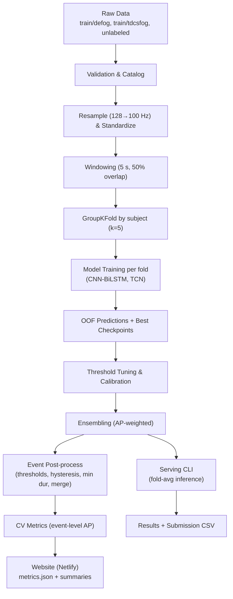

## Parkinson's FOG Detection — Technical Guide (Deep Dive)

This guide explains the end‑to‑end system we built for Parkinson’s Freezing of Gait (FOG) detection: data, preprocessing, models, training, evaluation, ensembling, serving, the website, and deployment. It includes diagrams, technical details of ML/DL components, and concrete code snippets. A closing section outlines practical steps to improve current low accuracy.

### System Overview



### Data and Metadata

- Sources:
  - `defog` (home, ~100 Hz): `train/defog/*.csv`
  - `tdcsfog` (lab, 128 Hz): `train/tdcsfog/*.csv` with 6 columns: `Time, AccV, AccML, AccAP, StartHesitation, Turn, Walking`
  - `unlabeled/*.parquet` (optional SSL pretraining)
- Labels: 3 classes — `StartHesitation, Turn, Walking` (framewise 0/1).
- Splits: GroupKFold (k=5) by `subject_id` (keeps subjects disjoint across folds).

### Preprocessing

- Resampling: `tdcsfog` 128 Hz → 100 Hz (polyphase is preferred; current code assumes aligned sampling for expedience).
- Standardization: per‑source/global scaling with optional subject residual correction.
- Windowing: fixed 5 s windows, 50% overlap; a window’s label is positive if any frame in that window is positive for a class.

### Datasets and Loaders

Key components:
- `src/data/windows.py`: creates overlapping windows of shape `(T, C)` from raw CSV.
- `src/data/dataset.py`: returns pairs `(x, y)` where `x: (T,3)` for `AccV,AccML,AccAP`, and `y: (3,)` window labels.

Example (creating a dataset):

```python
from src.data.dataset import WindowDataset

paths = ["train/defog/xxxx.csv", "train/tdcsfog/yyyy.csv"]
ds = WindowDataset(paths, window_s=5.0, overlap=0.5, sample_rate_hz=100,
                   label_cols=["StartHesitation","Turn","Walking"])
x, y = ds[0]  # x: (T,3), y: (3,)
```

### Models

- CNN‑BiLSTM (`src/models/cnn_bilstm.py`): 1D Conv blocks to extract local temporal features → BiLSTM to capture long‑range dependencies → framewise logits.
- TCN (`src/models/tcn.py`): dilated temporal convolutions stacking multiple receptive fields for efficient long context modeling.
- Registry (`src/models/registry.py`): `build_model(name, **kwargs)` abstraction so training/serving code can stay generic.

High‑level forward contract:
```python
# (batch, time, channels) -> (batch, time, num_classes)
logits = model(x)
```

### Losses and Class Imbalance

- Focal BCE (`src/losses/focal_bce.py`): reduces loss contribution of easy negatives; focuses on hard positives.
  - Form: \( \text{FL}(p_t) = -\alpha (1 - p_t)^\gamma \log(p_t) \), with \(\gamma \in [1,2]\).
- Positive‑aware sampling (`src/train/sampler.py`): increases proportion of windows with positives in each batch.

### Optimizer, Scheduler, Early Stopping

- Optimizer: AdamW (typical \(\text{lr} \in [1e-4, 3e-3]\)).
- Scheduler: Cosine decay with warmup.
- Early stopping on validation AP (patience ~3–5) to prevent overfitting.

### Training Pipeline (per fold)

Orchestrated scripts:
- `src/train/run_fold_train.py` and `src/train/run_fold_train_tcn.py`: train CNN‑BiLSTM and TCN per fold with focal BCE, sampling, transforms, scheduler, and early stopping.
- `src/train/run_all_folds.py`: iterate folds and models.

Minimal training example (conceptual):
```python
from src.models.registry import build_model
from src.data.dataset import WindowDataset
import torch

labels = ["StartHesitation","Turn","Walking"]
ds = WindowDataset(val_paths, window_s=5, overlap=0.5, sample_rate_hz=100, label_cols=labels)
model = build_model("cnn_bilstm", num_classes=len(labels))
for x, y in DataLoader(ds, batch_size=32):
    logits = model(x)                # (B,T,K)
    probs = torch.sigmoid(logits)    # (B,T,K)
    # compute loss, backprop, scheduler step ...
```

### OOF, Threshold Tuning, Calibration

- Save OOF predictions and best checkpoints per fold (OOF = out‑of‑fold predictions for validation subjects).
- Threshold tuning (event‑level): choose per‑class thresholds that maximize AP on validation (we also support domain defaults via `configs/postprocess.yaml`).
- Calibration: optional isotonic calibration per class/fold to align probabilities with observed frequencies.

### Ensembling

- Level‑1: average across folds (fold‑averaged inference).
- Cross‑model: weighted average (CNN‑BiLSTM vs TCN). We fit weights to maximize window‑level AP on OOF; current weights tracked in `artifacts/ensemble/weights.json`.

Snippet (ensemble math):
```python
# mix = w_cnn * cnn_probs + (1 - w_cnn) * tcn_probs
```

### Event Post‑processing

Convert per‑frame probabilities to events using:
- Per‑class thresholds (domain defaults or tuned)
- Hysteresis (start/continue thresholds)
- Minimum duration constraint
- Merge close events into one

Key function: `src/eval/postprocess.py: probs_to_intervals()`

### Metrics

We report event‑level Average Precision (AP) at IoU≥0.5 with deterministic PR interpolation. The cross‑validation macro AP averages APs across classes and folds.

- Event scoring logic: `src/eval/scorer.py`
- CV aggregation and website export: `src/eval/compute_cv_metrics.py` → `website/netlify/metrics.json`

### Serving / Inference Pipeline

- Batch ensemble inference with fold averaging, optional calibration, and post‑processing: `src/serve/ensemble_infer.py`
- Summaries: `src/serve/summarize.py` (counts, durations) → `summary.csv/json`
- Submission: `src/serve/submission.py` converts intervals to a simple CSV schema.
- CLI wrapper: `src/serve/cli.py` (one‑shot: infer both domains, summarize, optionally export to `website/netlify`).

Commands (examples; adjust paths as needed):
```bash
# Ensemble inference + summaries to artifacts
python -c "import sys, os; sys.path.append(os.getcwd()); from src.serve.cli import run; run()"

# Export summaries for website (dev server will read these files)
python -c "import sys, os; sys.path.append(os.getcwd()); from src.serve.cli import run; import sys as s; s.argv=['', '--export_web']; run()"

# Generate submission CSV from intervals
python -c "import sys, os; sys.path.append(os.getcwd()); from src.serve.submission import build_submission; build_submission('artifacts/infer/defog/ens','artifacts/infer/defog/ens/submission.csv')"
```

### Website (Netlify)

- Static site in `website/netlify` with:
  - Home: gait parameter screening UI with sliders and numeric inputs
  - About: educational page about gait and Parkinson’s
  - Results: loads `summary_defog.csv`, `summary_tdcs.csv` and shows aggregate info
  - i18n/RTL: `website/netlify/i18n.js` manages text in English, Arabic (RTL), Hindi, Telugu, Tamil, Kannada, Malayalam
  - Doctor summary PDF: jsPDF generates a downloadable single‑page report
  - Care Finder: opens a dedicated page (`care.html`) with nearby hospital search using OSM APIs
- Netlify config: `netlify.toml` publishing `website/netlify`

Dev run:
```bash
python -m http.server 8888 -d website/netlify
# Open http://localhost:8888
```

### Deployment (Netlify)

- Repository: `.gitignore` excludes all large Kaggle data and artifacts (keeps website assets tracked).
- Netlify: Create new site → From Git → pick repo → Build command: leave empty → Publish directory: `website/netlify`.

### Design Choices and Rationale

- Uniform forward signature across models enables easy ensembling and future model swaps.
- DRY: paths, thresholds, and hyperparameters are centralized in configs/artifacts and read at runtime.
- Reproducibility: seeds, deterministic scorer, and logs.
- Separation of concerns: training vs. serving vs. web app.

### Selected Code Walkthroughs

1) Event scoring (simplified idea)
```python
from src.eval.scorer import score_intervals, mean_ap

preds = {"Turn": [(s,e,score), ...], "Walking": [...], "StartHesitation": [...]}  # by class
gts   = {"Turn": [(s,e), ...],           ...}
ap_by_class = score_intervals(preds, gts, ["StartHesitation","Turn","Walking"], iou_thr=0.5)
macro_ap = mean_ap(ap_by_class)
```

2) Post‑processing
```python
from src.eval.postprocess import probs_to_intervals
intervals = probs_to_intervals(probs, classes=["StartHesitation","Turn","Walking"],
                               fps=100.0, thresholds={"Turn":0.28, ...},
                               hysteresis=(0.6,0.4), min_duration_s=0.4, merge_gap_s=0.6)
```

3) Ensemble fold averaging
```python
# Average per‑fold probabilities for the same model name
avg = np.mean([pd.read_csv(fp).values for fp in fold_prob_paths], axis=0)
```

### Current Performance (CV)

- With stable domain thresholds (no per‑fold calibration in metrics):
  - Model (CV macro AP): ~0.12972 (12.972%)
  - CNN: ~12.472%
  - TCN: ~13.113%

### Improving Low Accuracy — Practical Roadmap

1) Post‑processing and Metrics fidelity
- Per‑fold threshold tuning on event‑level AP (already supported). Persist and use per‑fold thresholds during CV reporting.
- Increase minimum duration for `Turn` (e.g., 0.6–0.8 s), consider class‑specific merge gaps.
- Probability smoothing (already added) — verify kernel sizes (3–7) per domain.

2) Temporal context and input resolution
- Extend window length to 8–10 s; reduce stride to 25–33% (more overlap for smoother temporal decisions).
- For detectors, consider variable‑length sequences (e.g., 30–60 s) with overlapping segments.

3) Model capacity and architectures
- CNN‑BiLSTM: increase channels and LSTM hidden size (e.g., 256), add attention pooling.
- TCN: deeper stacks with residual connections; mix dilation patterns.
- Add a Transformer encoder model for global context; experiment with relative positional encodings.

4) Data augmentation and regularization
- Stronger aug: jitter, scaling, rotate3D with domain‑appropriate ranges.
- Label smoothing (0.05–0.1) to reduce over‑confidence.
- MixUp/CutMix‑style temporal blends (cautiously for time‑series).

5) Class imbalance & sampling
- Increase positive window ratio to ~0.5; add hard‑negative mining (turning without FOG).

6) Calibration and ensembling
- Fit isotonic calibrators per fold on OOF (using max‑pooled scores). Apply during metrics computation.
- Optimize ensemble weights directly on event‑level AP rather than window AP; consider domain‑specific weights.
- Optional rank‑averaging to reduce mis‑calibration sensitivity.

7) Cross‑domain and domain adaptation
- Train on one domain, validate on the other; report ΔAP.
- Domain‑specific batch norm or light adapters; gradient reversal for domain invariance as an ablation.

8) Self‑supervised learning (unlabeled set)
- Pretrain backbones on `unlabeled/*.parquet` with contrastive or masked‑prediction objectives; fine‑tune on labeled data.

9) Optimization details
- Tune lr, weight decay, and warmup steps via small sweeps.
- Gradient accumulation to use larger effective batch sizes on limited GPUs.

10) Evaluation hygiene
- Ensure validation sets cover `Turn/StartHesitation` moments; verify label prevalence per fold.
- Track both window‑level and event‑level AP; use the latter as the primary KPI.

### Appendix — Key Paths

- Configs: `configs/*.yaml`
- Training scripts: `src/train/*.py`
- Eval & post‑process: `src/eval/*.py`
- Serving: `src/serve/*.py`
- Website: `website/netlify/*`
- Netlify publish dir: `website/netlify`

---
This guide is versioned with the codebase. For updates, adjust configs and scripts as the pipeline evolves, and re‑run the metrics export to refresh the website.


